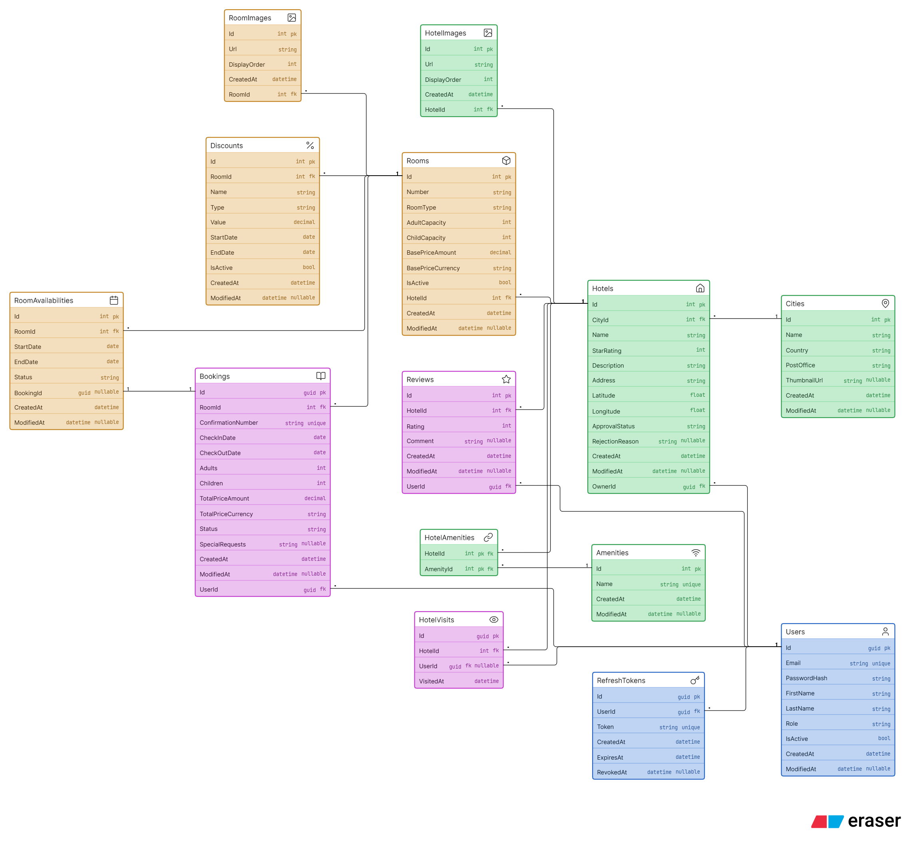

# TABP Database Schema

This document describes every table in the TABP database: its columns, keys, indexes, relationships and the rules the
domain enforces on it.

- **Engine:** SQL Server, via EF Core (code-first)
- **Current migration:** `20260923095420_AddCityThumbnailUrl` (after `20260920112153_InitialCreate`), both committed
  in `Infrastructure/Migrations`.
- **Source of truth:** `Infrastructure/Migrations/AppDbContextModelSnapshot.cs`, generated from the configurations in
  `Infrastructure/Persistence/Configurations/*.cs`
- **Diagram:** [`database-erd.eraser`](database-erd.eraser). Paste it into an eraser.io *Entity Relationship Diagram*
  block. See [Viewing the diagram](#viewing-the-diagram-eraserio).

> If this file disagrees with the model snapshot, the snapshot is correct. Update this file when you add a migration.
>
> **Last verified 2026-09-23** against the live dev database: both migrations applied, and all 14 tables, 106 columns
> (type, length, nullability), 20 indexes and 16 foreign keys match this document and `database-erd.eraser`.

---

## 1. Overview

There are **14 tables**, grouped into four areas:

| Area                      | Tables                                                           | Purpose                                     |
|---------------------------|------------------------------------------------------------------|---------------------------------------------|
| **Identity**              | `Users`, `RefreshTokens`                                         | Accounts, roles, JWT refresh-token rotation |
| **Catalog**               | `Cities`, `Hotels`, `HotelImages`, `Amenities`, `HotelAmenities` | What can be browsed and searched            |
| **Rooms & pricing**       | `Rooms`, `RoomImages`, `Discounts`, `RoomAvailabilities`         | Bookable inventory, prices and calendar     |
| **Bookings & engagement** | `Bookings`, `Reviews`, `HotelVisits`                             | Reservations, ratings and view analytics    |

### Relationship map

```
Cities ──1:N──> Hotels <──N:1── Users (owner)
                  │                 │
                  ├──1:N──> HotelImages
                  ├──N:M──> Amenities   (via HotelAmenities)
                  ├──1:N──> Reviews <───────┤
                  ├──1:N──> HotelVisits <───┤ (nullable)
                  └──1:N──> Rooms           │
                              ├──1:N──> RoomImages
                              ├──1:N──> Discounts
                              ├──1:N──> RoomAvailabilities ┄┄> Bookings (logical only)
                              └──1:N──> Bookings <─────────┤
                                                            │
Users ──1:N──> RefreshTokens                                 │
Users ──1:N──> Bookings ─────────────────────────────────────┘
```

---

## 2. Conventions used across the schema

| Convention            | Detail                                                                                                                                      | Why                                                                                                                                                                                                                                                                         |
|-----------------------|---------------------------------------------------------------------------------------------------------------------------------------------|-----------------------------------------------------------------------------------------------------------------------------------------------------------------------------------------------------------------------------------------------------------------------------|
| **Primary key types** | `Guid` for `Users`, `Bookings`, `RefreshTokens`, `HotelVisits`. Identity `int` for everything else.                                         | GUIDs are used where IDs are exposed or should not be guessable: user IDs appear in JWTs, and booking IDs and refresh tokens are security-sensitive. `HotelVisits` is an append-only log that is written without a round-trip. Catalog data uses compact, sequential `int`. |
| **Audit columns**     | `CreatedAt` (required) and `ModifiedAt` (nullable), both `datetime2`, stored in UTC. They come from `AuditableEntity<TId>`.                 | `HotelImages`, `RoomImages` and `RefreshTokens` have `CreatedAt` only because they are never edited. `HotelAmenities` and `HotelVisits` have neither.                                                                                                                       |
| **Enums**             | Stored as **strings** (`nvarchar(20)`, or `nvarchar(30)` for `RoomType`) using `HasConversion<string>()`.                                   | The data is readable in SQL, and reordering enum members can never silently change the meaning of existing rows.                                                                                                                                                            |
| **Value objects**     | `Money` and `DateRange` are EF *owned types*. They are flattened into columns on their owner's table instead of having tables of their own. | They have no identity of their own and belong to the owning row.                                                                                                                                                                                                            |
| **Money**             | `decimal(18,2)` amount plus `nvarchar(3)` ISO currency code.                                                                                | Avoids floating-point rounding. The currency travels with the amount.                                                                                                                                                                                                       |
| **Dates**             | Stay, discount and availability ranges use `date` (`DateOnly`). Timestamps use `datetime2`.                                                 | A night is a calendar date, so no time zone is involved.                                                                                                                                                                                                                    |
| **Delete behavior**   | `CASCADE` only for children that fully belong to a parent. `RESTRICT` for anything with business or history value.                          | See [section 5](#5-delete-behavior-summary).                                                                                                                                                                                                                                |
| **Collections**       | Navigation collections are backed by private fields (`PropertyAccessMode.Field`).                                                           | Aggregates control their own invariants, so outside code cannot `.Add()` to the collections directly.                                                                                                                                                                       |

---

## 3. Tables

### 3.1 `Users`

Accounts for all three roles.

| Column                     | Type               | Null     | Notes                                                                            |
|----------------------------|--------------------|----------|----------------------------------------------------------------------------------|
| `Id`                       | `uniqueidentifier` | no       | **PK**                                                                           |
| `Email`                    | `nvarchar(256)`    | no       | **Unique**                                                                       |
| `PasswordHash`             | `nvarchar(500)`    | no       | Never plaintext                                                                  |
| `FirstName`                | `nvarchar(100)`    | no       |                                                                                  |
| `LastName`                 | `nvarchar(100)`    | no       |                                                                                  |
| `Role`                     | `nvarchar(20)`     | no       | `UserRole`: `Customer`, `HotelOwner`, `Admin`                                    |
| `IsActive`                 | `bit`              | no       | Deactivating the account blocks login and keeps the row. This is a soft disable. |
| `CreatedAt` / `ModifiedAt` | `datetime2`        | no / yes |                                                                                  |

**Indexes:** `IX_Users_Email` (unique)

**Relationships (parent of):**

- `RefreshTokens.UserId`: **cascade**
- `Hotels.OwnerId`: **restrict**
- `Bookings.UserId`: **restrict**
- `Reviews.UserId`: **restrict**
- `HotelVisits.UserId`: **set null**

**Rules:** name, email and password hash must not be blank. Users are deactivated with `Deactivate()` instead of being
deleted, and the restrict FKs above mean a user with any history cannot be hard-deleted.

---

### 3.2 `RefreshTokens`

Rotating refresh tokens used with JWT access tokens.

| Column            | Type               | Null | Notes                                    |
|-------------------|--------------------|------|------------------------------------------|
| `Id`              | `uniqueidentifier` | no   | **PK**                                   |
| `UserId`          | `uniqueidentifier` | no   | **FK → `Users.Id`** (cascade)            |
| `Token`           | `nvarchar(256)`    | no   | **Unique**                               |
| `CreatedAt`       | `datetime2`        | no   |                                          |
| `ExpiresAt`       | `datetime2`        | no   |                                          |
| `RevokedAt`       | `datetime2`        | yes  | Set when the token is revoked or rotated |

**Indexes:** `IX_RefreshTokens_Token` (unique), `IX_RefreshTokens_UserId`

**Rules:** `IsActive` is computed and not stored: a token is active when it is not revoked and not expired. A token can
be revoked only once — a second `Revoke()` throws `InvalidStateTransitionException` — and rotation revokes the current
token when it issues the successor.

---

### 3.3 `Cities`

| Column                     | Type             | Null     | Notes       |
|----------------------------|------------------|----------|-------------|
| `Id`                       | `int` identity   | no       | **PK**      |
| `Name`                     | `nvarchar(150)`  | no       |             |
| `Country`                  | `nvarchar(100)`  | no       |             |
| `PostOffice`               | `nvarchar(20)`   | no       | Postal code |
| `ThumbnailUrl`             | `nvarchar(2048)` | yes      | Optional image for city cards ("Trending destinations"). The API only accepts an absolute http(s) URL. Added by `AddCityThumbnailUrl`. |
| `CreatedAt` / `ModifiedAt` | `datetime2`      | no / yes |             |

**Indexes:** `IX_Cities_Name_Country` (unique, composite), so the same city name can exist in different countries.

**Relationships:** parent of `Hotels.CityId` (**restrict**). A city cannot be deleted while it has hotels.
`DeleteCityCommandHandler` checks this first, and the FK is the safety net.

---

### 3.4 `Hotels`

| Column                     | Type               | Null     | Notes                                                    |
|----------------------------|--------------------|----------|----------------------------------------------------------|
| `Id`                       | `int` identity     | no       | **PK**                                                   |
| `CityId`                   | `int`              | no       | **FK → `Cities.Id`** (restrict)                          |
| `OwnerId`                  | `uniqueidentifier` | no       | **FK → `Users.Id`** (restrict)                           |
| `Name`                     | `nvarchar(200)`    | no       |                                                          |
| `StarRating`               | `int`              | no       | 1–5                                                      |
| `Description`              | `nvarchar(4000)`   | no       |                                                          |
| `Address`                  | `nvarchar(300)`    | no       |                                                          |
| `Latitude`                 | `float`            | no       | −90 to 90                                                |
| `Longitude`                | `float`            | no       | −180 to 180                                              |
| `ApprovalStatus`           | `nvarchar(20)`     | no       | `HotelApprovalStatus`: `Pending`, `Approved`, `Rejected` |
| `RejectionReason`          | `nvarchar(1000)`   | yes      | Required when the hotel is rejected                      |
| `CreatedAt` / `ModifiedAt` | `datetime2`        | no / yes |                                                          |

**Indexes:** `IX_Hotels_CityId`, `IX_Hotels_OwnerId`

**Relationships (parent of):** `Rooms`, `HotelImages`, `HotelAmenities`, `Reviews` and `HotelVisits`, all with **cascade
**.

**Approval workflow:**

```
CreateByOwner ──> Pending ──Approve──> Approved      (publicly visible)
                     │
                     └──Reject(reason)──> Rejected ──Resubmit──> Pending
CreateByAdmin ──> Approved
```

Only `Approved` hotels are publicly visible (`IsPubliclyVisible`). The average rating is **computed** from `Reviews` and
is not stored.

**Delete rule:** `DeleteHotelCommandHandler` blocks deletion while the hotel has any rooms, so the cascades only run for
hotels that are already empty.

---

### 3.5 `HotelImages`

| Column         | Type             | Null | Notes                                        |
|----------------|------------------|------|----------------------------------------------|
| `Id`           | `int` identity   | no   | **PK**                                       |
| `HotelId`      | `int`            | no   | **FK → `Hotels.Id`** (cascade)               |
| `Url`          | `nvarchar(2048)` | no   |                                              |
| `DisplayOrder` | `int`            | no   | Assigned as `max + 1` when an image is added |
| `CreatedAt`    | `datetime2`      | no   |                                              |

**Indexes:** `IX_HotelImages_HotelId_DisplayOrder`. This index is not unique.

---

### 3.6 `Amenities`

A global lookup table, for example "Wi-Fi" or "Pool".

| Column                     | Type            | Null     | Notes      |
|----------------------------|-----------------|----------|------------|
| `Id`                       | `int` identity  | no       | **PK**     |
| `Name`                     | `nvarchar(100)` | no       | **Unique** |
| `CreatedAt` / `ModifiedAt` | `datetime2`     | no / yes |            |

**Relationships:** parent of `HotelAmenities.AmenityId` (**restrict**). An amenity that any hotel uses cannot be
deleted. `DeleteAmenityCommandHandler` checks this first.

---

### 3.7 `HotelAmenities` (join table)

The many-to-many link between `Hotels` and `Amenities`.

| Column      | Type  | Null | Notes                                               |
|-------------|-------|------|-----------------------------------------------------|
| `HotelId`   | `int` | no   | **PK (part 1)**, **FK → `Hotels.Id`** (cascade)     |
| `AmenityId` | `int` | no   | **PK (part 2)**, **FK → `Amenities.Id`** (restrict) |

**Indexes:** composite PK `(HotelId, AmenityId)`, plus `IX_HotelAmenities_AmenityId`

The asymmetric delete rules are deliberate. Deleting a hotel removes its amenity links. Deleting an amenity that is
still in use is blocked.

---

### 3.8 `Rooms`

| Column                     | Type            | Null     | Notes                                                                     |
|----------------------------|-----------------|----------|---------------------------------------------------------------------------|
| `Id`                       | `int` identity  | no       | **PK**                                                                    |
| `HotelId`                  | `int`           | no       | **FK → `Hotels.Id`** (cascade)                                            |
| `Number`                   | `nvarchar(100)` | no       | Room number, unique per hotel                                             |
| `RoomType`                 | `nvarchar(30)`  | no       | `RoomType`: `Standard`, `Budget`, `Deluxe`, `Suite`, `Luxury`, `Boutique` |
| `AdultCapacity`            | `int`           | no       | > 0                                                                       |
| `ChildCapacity`            | `int`           | no       | ≥ 0                                                                       |
| `BasePriceAmount`          | `decimal(18,2)` | no       | Owned `Money`, price per night                                            |
| `BasePriceCurrency`        | `nvarchar(3)`   | no       | Owned `Money`                                                             |
| `IsActive`                 | `bit`           | no       | `false` means retired or soft-deleted                                     |
| `CreatedAt` / `ModifiedAt` | `datetime2`     | no / yes |                                                                           |

**Indexes:** `IX_Rooms_HotelId_Number` (unique, composite)

**Relationships (parent of):** `RoomImages`, `Discounts` and `RoomAvailabilities` with **cascade**. `Bookings` with *
*restrict**.

**Soft delete:** a room that has bookings is never hard-deleted. `MarkDeleted()` sets `IsActive = false` and changes
`Number` to `"{Number}::deleted::{guid}"`. This frees the original number for a new room without breaking the unique
index, and bookings still point to an identifiable row. `Number` is 100 characters long to make room for that suffix.
`Retire()` and `Reactivate()` switch `IsActive` without changing the number.

**Rules:** a room is available for a date range only if it is active **and** none of its `RoomAvailabilities` rows
overlap the range.

---

### 3.9 `RoomImages`

Same shape as `HotelImages`, but scoped to a room.

| Column         | Type             | Null | Notes                         |
|----------------|------------------|------|-------------------------------|
| `Id`           | `int` identity   | no   | **PK**                        |
| `RoomId`       | `int`            | no   | **FK → `Rooms.Id`** (cascade) |
| `Url`          | `nvarchar(2048)` | no   |                               |
| `DisplayOrder` | `int`            | no   |                               |
| `CreatedAt`    | `datetime2`      | no   |                               |

**Indexes:** `IX_RoomImages_RoomId_DisplayOrder`. This index is not unique.

---

### 3.10 `Discounts`

Time-boxed price reductions for a room.

| Column                     | Type            | Null     | Notes                                       |
|----------------------------|-----------------|----------|---------------------------------------------|
| `Id`                       | `int` identity  | no       | **PK**                                      |
| `RoomId`                   | `int`           | no       | **FK → `Rooms.Id`** (cascade)               |
| `Name`                     | `nvarchar(150)` | no       |                                             |
| `Type`                     | `nvarchar(20)`  | no       | `DiscountType`: `Percentage`, `FixedAmount` |
| `Value`                    | `decimal(18,2)` | no       | > 0. At most 100 when `Type = Percentage`.  |
| `StartDate`                | `date`          | no       |                                             |
| `EndDate`                  | `date`          | no       | Must be after `StartDate`                   |
| `IsActive`                 | `bit`           | no       | Deactivated instead of deleted              |
| `CreatedAt` / `ModifiedAt` | `datetime2`     | no / yes |                                             |

**Indexes:** `IX_Discounts_RoomId_StartDate_EndDate`. This index also serves the FK and speeds up "active discount on
date X" lookups.

**Pricing:** `Room.GetActivePrice(date)` applies the first discount that is active on that date. `CreateBooking`
currently uses the price on the **check-in date** multiplied by the number of nights.

---

### 3.11 `RoomAvailabilities`

The room's calendar. Each row is a date range that is **not** available. The table is effectively the reverse of
availability: a room is free for any dates without a row.

| Column                     | Type               | Null     | Notes                                                                     |
|----------------------------|--------------------|----------|---------------------------------------------------------------------------|
| `Id`                       | `int` identity     | no       | **PK**                                                                    |
| `RoomId`                   | `int`              | no       | **FK → `Rooms.Id`** (cascade)                                             |
| `StartDate`                | `date`             | no       | Owned `DateRange`                                                         |
| `EndDate`                  | `date`             | no       | Owned `DateRange`                                                         |
| `Status`                   | `nvarchar(20)`     | no       | `AvailabilityStatus`: `Booked`, `Blocked`                                 |
| `BookingId`                | `uniqueidentifier` | yes      | Set when `Status = Booked`. Null for manual blocks. **No FK constraint.** |
| `CreatedAt` / `ModifiedAt` | `datetime2`        | no / yes |                                                                           |

**Indexes:** `IX_RoomAvailabilities_RoomId`

**How rows are created:**

- `Room.Reserve(range, bookingId)` adds a `Booked` row when a booking is created, in the same `SaveChanges` call as the
  booking.
- `Room.Block(range)` adds a `Blocked` row, for example for maintenance or an owner hold.
- `Room.Unblock()` removes `Blocked` rows only. `Booked` rows must be released by cancelling the booking.

**Note: `BookingId` is a logical reference only.** The database does not enforce it, so deleting or cancelling a booking
does not update this row automatically. Application code must keep the two in sync (
see [section 6](#6-known-gaps--things-to-watch)).

---

### 3.12 `Bookings`

| Column                     | Type               | Null     | Notes                                                            |
|----------------------------|--------------------|----------|------------------------------------------------------------------|
| `Id`                       | `uniqueidentifier` | no       | **PK**                                                           |
| `UserId`                   | `uniqueidentifier` | no       | **FK → `Users.Id`** (restrict)                                   |
| `RoomId`                   | `int`              | no       | **FK → `Rooms.Id`** (restrict)                                   |
| `ConfirmationNumber`       | `nvarchar(50)`     | no       | **Unique**. Format: `HB-yyyyMMdd-XXXXXXXX`                       |
| `CheckInDate`              | `date`             | no       | Owned `DateRange` (`StayRange.StartDate`)                        |
| `CheckOutDate`             | `date`             | no       | Owned `DateRange` (`StayRange.EndDate`). Must be after check-in. |
| `Adults`                   | `int`              | no       | > 0                                                              |
| `Children`                 | `int`              | no       | ≥ 0                                                              |
| `TotalPriceAmount`         | `decimal(18,2)`    | no       | Owned `Money`, **fixed when the booking is made**                |
| `TotalPriceCurrency`       | `nvarchar(3)`      | no       | Owned `Money`                                                    |
| `Status`                   | `nvarchar(20)`     | no       | `BookingStatus` (see below)                                      |
| `SpecialRequests`          | `nvarchar(2000)`   | yes      |                                                                  |
| `CreatedAt` / `ModifiedAt` | `datetime2`        | no / yes |                                                                  |

**Indexes:** `IX_Bookings_ConfirmationNumber` (unique), `IX_Bookings_RoomId`, `IX_Bookings_UserId`

**Status lifecycle:**

```
Pending ──Confirm──> Confirmed ──CheckIn──> CheckedIn ──CheckOut──> CheckedOut
   │                     │                      │
   └─────────────────────┴──────Cancel──────────┴──> Cancelled
```

`Cancel()` is allowed from any status except `CheckedOut` and `Cancelled`.

**Why restrict on both FKs:** bookings are financial history. Deleting a room or user must never delete their bookings.
That is why rooms are soft-deleted and users are deactivated.

---

### 3.13 `Reviews`

| Column                     | Type               | Null     | Notes                          |
|----------------------------|--------------------|----------|--------------------------------|
| `Id`                       | `int` identity     | no       | **PK**                         |
| `HotelId`                  | `int`              | no       | **FK → `Hotels.Id`** (cascade) |
| `UserId`                   | `uniqueidentifier` | no       | **FK → `Users.Id`** (restrict) |
| `Rating`                   | `int`              | no       | 1–5                            |
| `Comment`                  | `nvarchar(2000)`   | yes      |                                |
| `CreatedAt` / `ModifiedAt` | `datetime2`        | no / yes |                                |

**Indexes:** `IX_Reviews_HotelId_UserId` (**unique**, so each user can review a hotel only once), `IX_Reviews_UserId`

**Rules:** a user can review a hotel only after a **completed stay** there, meaning a `CheckedOut` booking (
`HasCompletedStayAsync`). The application checks for a duplicate review before inserting, and the unique index enforces
the same rule under concurrency.

---

### 3.14 `HotelVisits`

An append-only analytics log with one row each time a hotel's detail page is viewed. It powers "Recently visited" and "
Trending destinations".

| Column      | Type               | Null | Notes                                                            |
|-------------|--------------------|------|------------------------------------------------------------------|
| `Id`        | `uniqueidentifier` | no   | **PK**                                                           |
| `HotelId`   | `int`              | no   | **FK → `Hotels.Id`** (cascade)                                   |
| `UserId`    | `uniqueidentifier` | yes  | **FK → `Users.Id`** (**set null**). Null for anonymous visitors. |
| `VisitedAt` | `datetime2`        | no   |                                                                  |

**Indexes:** `IX_HotelVisits_UserId_VisitedAt` (recently visited by a user), `IX_HotelVisits_HotelId_VisitedAt`
(intended for trending in a time window; the current trending-cities query counts **all** visits, with no window)

**Why set null:** when a user is removed, their visits still count toward trending statistics as anonymous visits.

---

## 4. Relationships reference

| #  | Child (FK)                     | → Parent (PK)  | Cardinality | Required | On delete                        |
|----|--------------------------------|----------------|-------------|----------|----------------------------------|
| 1  | `RefreshTokens.UserId`         | `Users.Id`     | N : 1       | yes      | **Cascade**                      |
| 2  | `Hotels.OwnerId`               | `Users.Id`     | N : 1       | yes      | Restrict                         |
| 3  | `Hotels.CityId`                | `Cities.Id`    | N : 1       | yes      | Restrict                         |
| 4  | `HotelImages.HotelId`          | `Hotels.Id`    | N : 1       | yes      | **Cascade**                      |
| 5  | `HotelAmenities.HotelId`       | `Hotels.Id`    | N : 1       | yes      | **Cascade**                      |
| 6  | `HotelAmenities.AmenityId`     | `Amenities.Id` | N : 1       | yes      | Restrict                         |
| 7  | `Rooms.HotelId`                | `Hotels.Id`    | N : 1       | yes      | **Cascade**                      |
| 8  | `RoomImages.RoomId`            | `Rooms.Id`     | N : 1       | yes      | **Cascade**                      |
| 9  | `Discounts.RoomId`             | `Rooms.Id`     | N : 1       | yes      | **Cascade**                      |
| 10 | `RoomAvailabilities.RoomId`    | `Rooms.Id`     | N : 1       | yes      | **Cascade**                      |
| 11 | `Bookings.UserId`              | `Users.Id`     | N : 1       | yes      | Restrict                         |
| 12 | `Bookings.RoomId`              | `Rooms.Id`     | N : 1       | yes      | Restrict                         |
| 13 | `Reviews.HotelId`              | `Hotels.Id`    | N : 1       | yes      | **Cascade**                      |
| 14 | `Reviews.UserId`               | `Users.Id`     | N : 1       | yes      | Restrict                         |
| 15 | `HotelVisits.HotelId`          | `Hotels.Id`    | N : 1       | yes      | **Cascade**                      |
| 16 | `HotelVisits.UserId`           | `Users.Id`     | N : 1       | **no**   | **Set null**                     |
| —  | `RoomAvailabilities.BookingId` | `Bookings.Id`  | N : 1       | no       | *No FK. Logical reference only.* |

**Many-to-many:** `Hotels` ↔ `Amenities` through `HotelAmenities`.

**Navigation-only relationships:** `Booking.Room`, `Review.User`, `HotelVisit.User` and `HotelVisit.Hotel` have no
inverse collection on the parent. For example, `Room` has no `Bookings` collection. This keeps the parent aggregates
from loading large histories.

---

## 5. Delete behavior summary

Cascade chains that can occur:

```
DELETE Hotel ──> Rooms ──> RoomImages, Discounts, RoomAvailabilities
             ├─> HotelImages
             ├─> HotelAmenities
             ├─> Reviews
             └─> HotelVisits
          (the API blocks this while the hotel has ANY rooms, active or soft-deleted;
           at the DB level it would also fail if any Room has a Booking, because Bookings.RoomId is RESTRICT)

DELETE User  ──> RefreshTokens
             └─> HotelVisits.UserId = NULL
          (blocked if the user owns Hotels, or has Bookings or Reviews)
```

Deletes that are **blocked** by `RESTRICT` (the application checks these first and returns a friendly error, and the FK
is the backstop):

| Deleting...  | ...is blocked while it has                                         |
|--------------|--------------------------------------------------------------------|
| a `City`     | any `Hotels`                                                       |
| an `Amenity` | any `HotelAmenities` links                                         |
| a `Room`     | any `Bookings`. Use soft delete (`MarkDeleted`) instead.           |
| a `User`     | owned `Hotels`, `Bookings` or `Reviews`. Use `Deactivate` instead. |

The design principle: **cascade only through ownership, restrict through history.** Images, amenity links, discounts and
the room calendar have no value without their parent. Bookings and reviews are records that must outlive whatever they
refer to.

---

## 6. Known gaps and things to watch

1. **`RoomAvailabilities.BookingId` has no FK.** There is not yet a `CancelBooking` command (`Booking.Cancel()` exists
   in the domain only). When one is added, it must also delete the matching `Booked` availability row. Otherwise the
   room stays blocked for those dates. Consider adding a real FK with `ON DELETE SET NULL`/`CASCADE`, or releasing the
   row inside the `Room` aggregate.
2. **No DB-level overlap protection for availability.** Double-booking is prevented by `IsAvailableAsync` plus the
   `Room.Reserve()` re-check inside the aggregate, but two concurrent transactions could still both pass. A serializable
   transaction, a row-version token on `Room`, or an exclusion-style check would close this.
3. **No concurrency tokens** (`rowversion`) on any table, so updates follow a last-write-wins policy.
4. **Composite image indexes are not unique**, so duplicate `DisplayOrder` values within one hotel or room are possible
   if written concurrently.
5. **Discount overlap is enforced in the application only.** `CreateDiscount`/`UpdateDiscount` validators reject an
   active discount that overlaps another on the same room (400), but there is no DB constraint, so a concurrent or
   direct write could still create one. `GetActivePrice` would then use whichever it finds first.
6. **No index for the hotel bookings list** (`GET /api/hotels/{id}/bookings`). It filters bookings by
   `Rooms.HotelId` (via `IX_Bookings_RoomId`) and sorts by `CheckInDate`. Fine at current volumes. If it gets slow,
   add an index on `Bookings (RoomId, CheckInDate)`.

---

## 7. Enum reference

| Enum                  | Column(s)                   | Values                                                         |
|-----------------------|-----------------------------|----------------------------------------------------------------|
| `UserRole`            | `Users.Role`                | `Customer`, `HotelOwner`, `Admin`                              |
| `HotelApprovalStatus` | `Hotels.ApprovalStatus`     | `Pending`, `Approved`, `Rejected`                              |
| `RoomType`            | `Rooms.RoomType`            | `Standard`, `Budget`, `Deluxe`, `Suite`, `Luxury`, `Boutique`  |
| `DiscountType`        | `Discounts.Type`            | `Percentage`, `FixedAmount`                                    |
| `AvailabilityStatus`  | `RoomAvailabilities.Status` | `Booked`, `Blocked`                                            |
| `BookingStatus`       | `Bookings.Status`           | `Pending`, `Confirmed`, `CheckedIn`, `CheckedOut`, `Cancelled` |

All of these are stored as their **name**, not their integer value.

---

## 8. Viewing the diagram (eraser.io)

The exported diagram (it matches the current schema, including `Cities.ThumbnailUrl`):



To re-render it, paste [`database-erd.eraser`](database-erd.eraser) into an eraser.io *Entity Relationship Diagram*
block and export it over this file (`assets/Database-Schema.png`).
